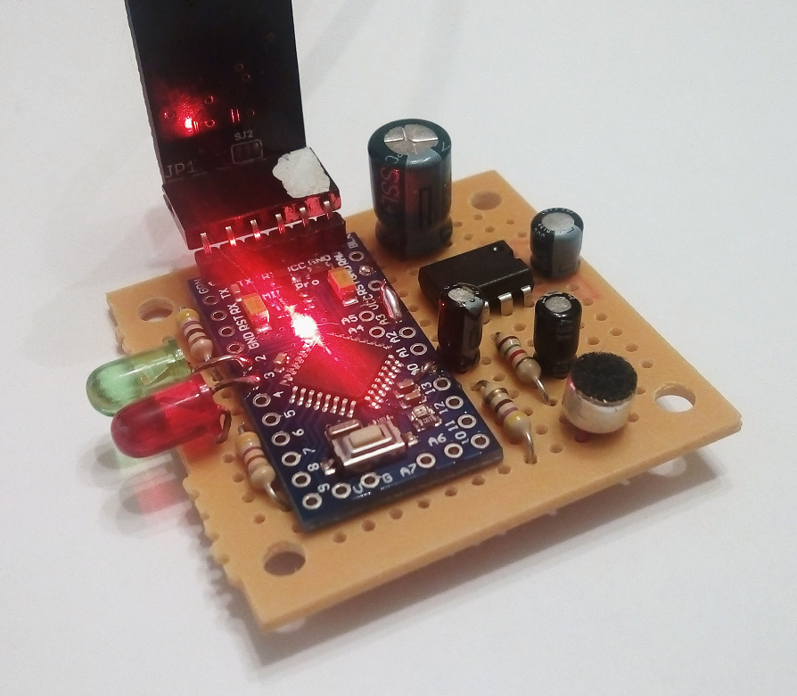
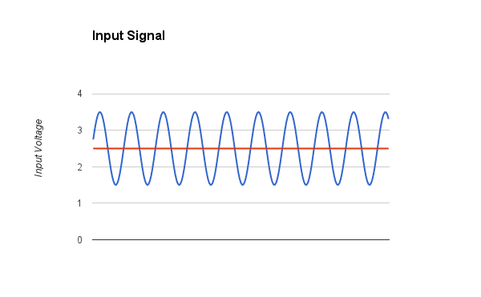
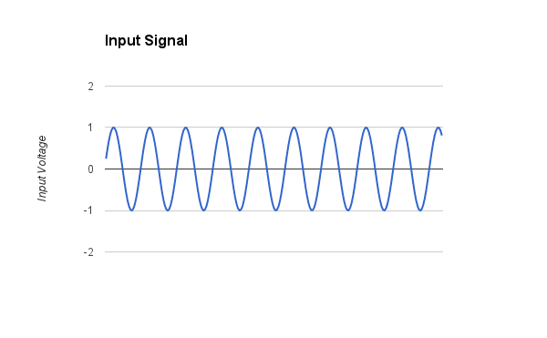
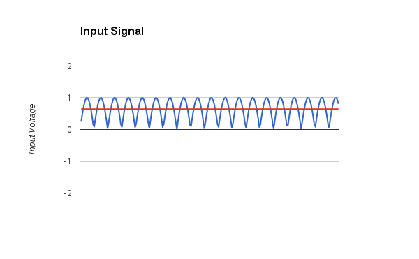
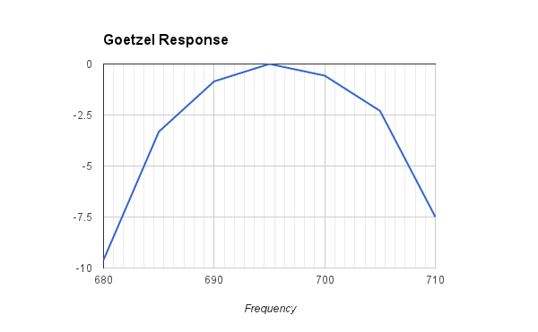
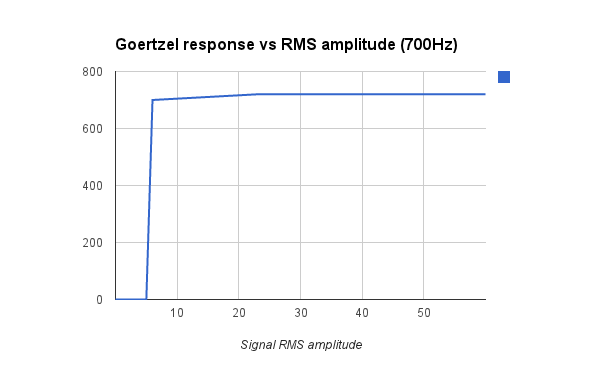
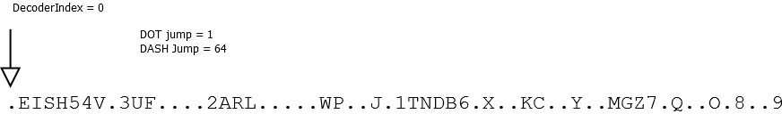
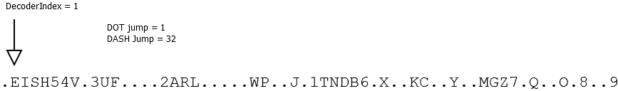

The goal of this project is to develop a device able to listen for audio containing morse code and decode its text to serial port.

The hardware is a very simple board I used in many other my DSP projects, just an Arduino Nano with a microphone and a pre-amp.

The current code expects audio at 700Hz and a morse speed around 13 WPM. You can see a video of the device in action at: https://www.youtube.com/watch?v=iYScOh34aIk

Signal detection
=============

After sampling the first thing we do is to remove the DC component, it should be remembered that the pramplifier is a class A amplifier and is DC coupled with the A/D, so the signal swings around VCC/2, the input signal looks like in the plot below:

This is good as the ADC can sample only levels above zero but we need to get rid of the DC to be able to evaluate the amplitude of the signal. After removing the DC we are left with the signal centered aroud zero:

At this point we rectify it and calculate an average level. If we didn't rectify it the average would be zero. The signal after rectification looks like this, and the red line represents the average:

Note that this signal has double frequency of the original and, will have also some extra harmonic content due to the discontinuity around zero, so this signal is suitable only to evaluate average power, for later processing the original signal minus the DC will be used.

After that we apply an AGC (Automatic Gain Conttrol), this doesn't enhance the SNR, since it's done after the D/A, anyhow it allows to keep the signal level constat, so that the output of the following stages is independent of the captured signal level. This is desirable as we aim only at detecting the presence of the tone. Additionally at this stage we apply a squelch, which is responsbile to mute completely the sampled signal if its level is below a certain threshold. This prevents noise from triggering the decoder.

Finally we use Goetzel to detect the presence of the 700Hz component of the captured audio. This is much more efficient than an FFT and, hence, allows to get estimates faster, so more often.  Once the presence of the signal is determined a simple state machine is employed to keep track of the current status at each iteration. Depending on the level being above or below a preset threshold the application estimates dots, dashes, inter-element, inter-letter and inter-word stages of the signal and proceeds to decode those to ASCII chars. The alghorithm employed to translate the sequence of dots and dashes to ASCII is decribed in the next section.

I have run some tests, by adding serial prints of values at various stages. The first is the frequency response of the Goertzel. I have produced tones of varying frequency, in few Hz steps, around 700Hz. The graph below shows the frequency respose:

The first thing we notice is that the peak of the respose is actually around 695, this is probably due to slight innacuracy in the sampling frequency, though I have no exact measure of the accuracy of the geerator (an HTML5 script). We can see anyhow that at a 15Hz deviation the respose is already more than 7dB down.

The following graph shows the action of the AGC and the squelch and represents the variation in amplitude of the Goertzel output as a fuction of the captured sigal amplitude. This was taken at a constant frequency of 700Hz:

We can see that with a captured RMS level below 5 there is no response, above that the response settles around 700 regardless of input signal amplitude, which is the desired response. 

Morse to ASCII
============

For the conversion from morse (sequences of dots and dashes) to ASCII I make use of an alghotithm that I have not seen published anywhere so far. The alghorithm performs fundamentally a binary search inside a precalculated string taking either one of two branches according to the current symbol being a dot or a dash. The pre calculated string has been prepared by running through the algorithm the morse code of each letter and seeing where it caused it to land in the string.

The algorithm can be decribed as follows. Have an index inside the lookup string inizialied to zero. Have an initial dash jump size of 64. At every received element (dot or dash) halve the initial dash jump and then increase by 1 the index inside the lookup string if a dot was received and by dash jump size if a dash was received. Repeat until a letter separator is reached, at that point the index inside the lookup string will point to the ASCII corresponding to the decoded morse.

        index=0
        dash_jump=64
        for each received element e
          dash_jump=dash_jump/2
          index = index + (e=='.')?1:dash_jump
        endfor
        ascii = lookupstring[index]
  
The current lookup string contains 64 symbols a size that guarantees no clashing if all A-Z and 0-9 digits are used. If more symbols are to be added extra space should be made in the lookup string to avoid clashing. The size can be empirically determined by ensuring, when creating the string, that no char is assigned to a position that already contains a char, if that happens the lookup string needs to be lengthened until no collisions are found.

Let's see an example step by step. Let's assume we receive a ".-", that is an "A". At the beginning the status is as in the following picture:

When the "." comes in we reduce the dash jump to half (32) and we then proceed to increase the pointer in the lookup string by one, as we received the dot.

At this point the index is on the "E", which makes sense as this would be an "E" if the symbol ended here. We instead receive a "-" so we go diving the dash jump to half again, that is to 16 and, since we have received a dash, we apply that offset to the index and end on postion 17 that contains an "A", as expected.

Note that with this method invalid strings of elements cannot be detected as invalid because you will end up landing anyway on a char in the string and, in some cases, this might be a valid char even if represented by a different sequence, since most of the lookup contains some symbols.
